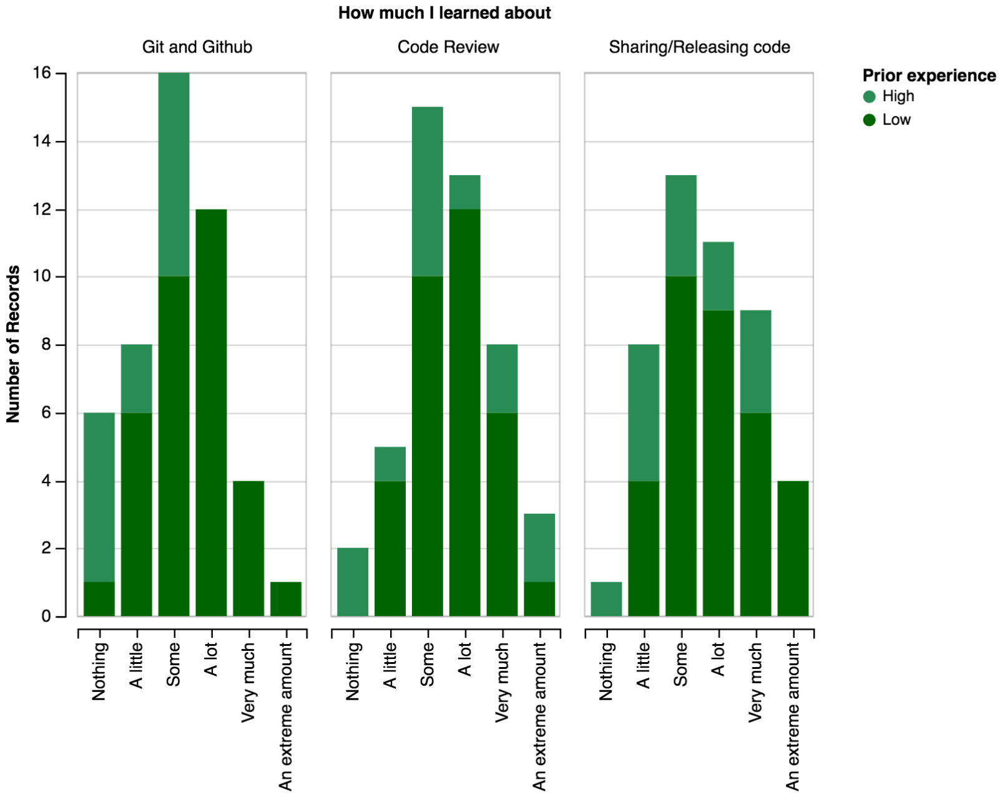
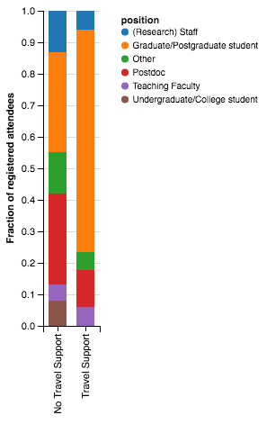
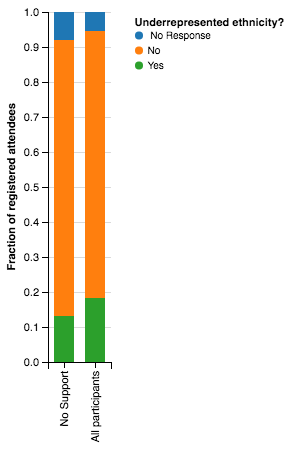
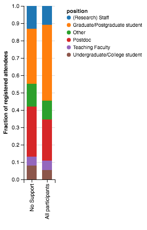

# Report on Grant for Python in Astronomy 2017

Python in Astronomy received enough support to provide over $13,000 of support to 17 of the 55 participants. All of the grant money was used for travel support.

One important goal of the workshop was to grow the astronomy open source community, and the reason we sought funding was to maximize the diversity of participants. We describe impacts in both areas below.

## Impact on participant skills

Over 80% of the participants completed a survey designed by one of the members of the Scientific Organizing Committee. One set of questions asked participants to indicate how much they learned about git/GitHub, code review, and sharing and releasing code. Roughly half of the participants indicated they learned "a lot", "very much" or "an extreme amount" about each of the topics. A shown in the chart below, the workshop had less impact on github knowledge and more impact on knowledge of how to share and release code.

Participants with a range of prior experience which each of these skills were accepted; those who indicated they had the most experience are colored light green in the chart. As anticipated, those participants learned less at the workshop because they came in as experts. However, even the experts picked up new skills at the workshop.

## Impact on participant diversity

Our motivation in approaching you for funding was to maximize the diversity of the participants in the workshop. As we explain below, your grant was critical to enabling diverse participation and had a measurable impact on the distribution of participants.

Our committement to that goal began with our participant selection process. We asked applicants to the workshop to indicate four factors we believed were relevant to increasing diversity, and set explicit targets for selected participants:

+ Does the applicant self-identify as a gender underrepresented in astronomy? Target: 50% yes, 50% no.
+ Does the applicant self-identify as a member of a race or ethnicity underrepresented in astronomy? Target: 40% yes, 60% no.
+ Geographical location of the applicant. Target: 1/3 each from North America, Western Europe, and all other regions.
+ Career stage of the applicant. Target: Roughly 50% early-career (undergraduate or graduate student, or postdoc), with the remainder roughly evenly divided between reaseearch staff, teaching faculty, and other (which included independent software developers).

The group of participants initially selected based on these criteria matched the criteria reasonably well, though the fraction of selected participants who answered yes to the gender question was 40%, rather than the target of 50%, and the fraction of participants who answered yes to the ethnicity was 35% rather than 40%. The primary reason the initial selection fell short of our targets is that we were constrained by who applied.

More of those who indentified as underrepresented indicated they needed full or partial support to attend (80% required support) than did those who did not identify as underrepresented (60% required support), so we expected that the availability of travel support would affect the range of participants. The charts below clearly indicate that financial support improved the diversity of participants in all of the ways we hoped it would:

  |  |  |  |
--|--|--|--|
 |  |  |  |

The distributions labeled "No Travel Support" are a reasonable proxy for what the distribution of participation would have been without your support, despite our efforts to explicitly include targets for diversity in our selection criteria. The need for support effectively acts as an independent selection criterion.

The particpants who received travel support exceeeded our target for gender diversity, came much closer to our target for ethnic diversity, enabled many more participants from non-North Amercian, non-Western European locations, and enlarged the fraction of participants who were graduate students.

Of the 55 participants, 17 received travel support, so to visualize the net impact of travel support it is useful to compare those registered participants without travel support to the pool of all registered participants. The charts below do that. In each of the cases travel support moved the distribution in the direction we had hoped it would.

  |  |  |  |
--|--|--|--|
 |  |  |  |
